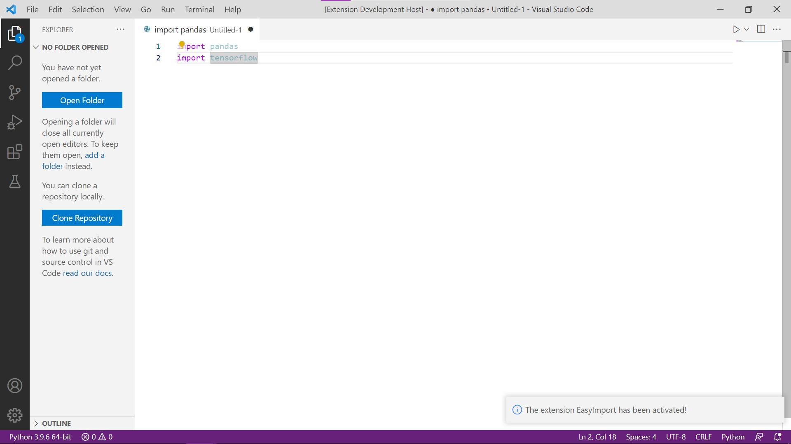
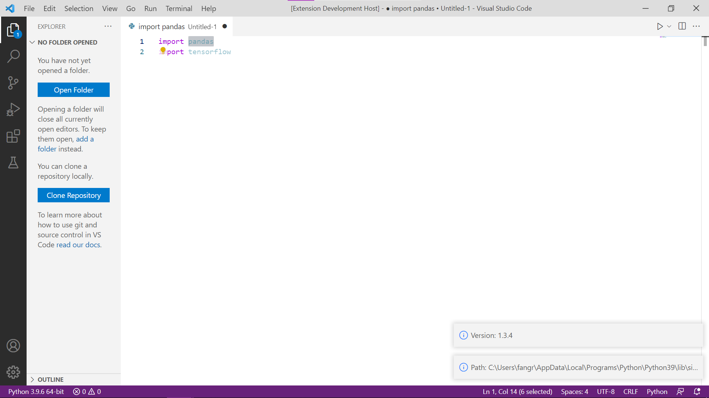
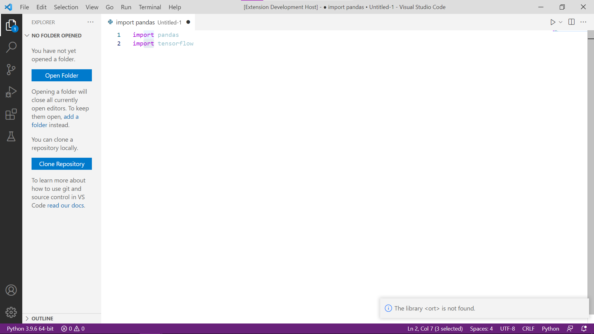

# easyimport README
  
This is the README for the extension "EasyImport".  

The extension is made for the DevRev Hackathon - Coding with AI competition (https://devrevhack0.devpost.com/?ref_content=default&ref_feature=challenge&ref_medium=portfolio).  
  
It is customised for Python users, who cannot specify the library directory and version for imports. The extension will help the user to detect the directory and the version of the library, for the user to determine whether it is the library he/she needs.  
  
The inspiration comes from me working on a borrowed GPU with only CUDA 9.0. The fact that I have to jump between tensorflow 1.9 (for GPU) and tensorflow 2.2 (on CPU) is purely suffering. And the fact that many developers often have more than one version of a certain library installed on their computer can also create trouble for those who do not have a habit of managing environment.   
  
This extension therefore aimes to help every developers out.  
  
Curretly due to my limited knowledge, the extension is only able to show the information of the library. In future updates, I would wish to update this extension so that the user can specify the library path and version for the import.  

## Features  
1. The user will need to activate the extension by entering the command "Run EasyImport".  
2. The user can highlight any library and run the commend "Find Path and Version", and the needed information will jump out.  
3. Some error-handling is placed for mis-select or uninstalled packages.  
  
#### **Screenshots of the features:**
#### Activation:
  

#### Main Function
  

#### Error Handling
  
  
  
A Demonstration video can be seen from this Youtube link:  
https://youtu.be/SqX-qF5Bgws  

## Requirements  
  
The extension requires a package `python-bridge` (URL: https://github.com/Submersible/node-python-bridge).  
It can be installed in Bash with `npm install python-bridge`.  
  
The user need to have python in their VSCode as well.  
  
## Extension Settings  
N.I.L.  
  
## Known Issues  
N.A.  
  
## Release Notes  
### 1.0.0  
Initial release of EasyImport  

